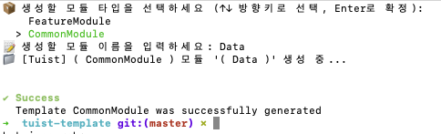

# Tuist Boilerplate Template

- Tuist 기반 iOS 프로젝트를 빠르게 시작하기 위한 템플릿

### 목적

- Tuist 초기 설정 및 구조 설계 시간 절약
- Clean Architecture 틀을 잡고, Modular 구조를 템플릿으로 재사용
- 반복 생성되는 모듈 자동화 코드 적용하여 시간 절약
- 새로운 프로젝트 시작 시 초기 진입 비용 최소화

### 초기 프로젝트 구조

```    
App
├─ Features (Presentations)
│ ├─ Root
│ ├─ ...
│ └─ ...
├─ Domain
├─ Data
├─ DI
└─ DesignSystem
```  

### 모듈 생성 가이드

본 프로젝트는 모듈 생성을 자동화하기 위해 Shell Script + Makefile 기반 명령어 제공  

**Common / Presentation 모듈 생성**  
> $ make module  

이후 실행 흐름  

1. 생성할 모듈 타입 선택
  - CommonModule
  - (Presentation/Feature)Module
2. 모듈 이름 입력
3. 입력 값을 기준으로 모듈 자동 생성

생성 결과  
- 디렉토리 구조 생성
- 기본 Project.swift 포함
- Tuist가 인식 가능한 상태로 구성

  

**주의 사항**   

- ModuleType 추가 필요
- Module+Extension name case 추가 필요
- Dependency 관계는 수동으로 작성 필요 (tuist edit)  
